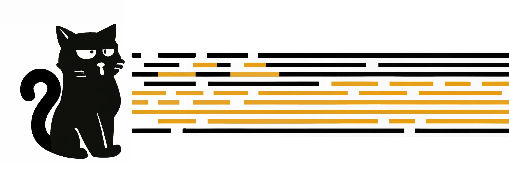
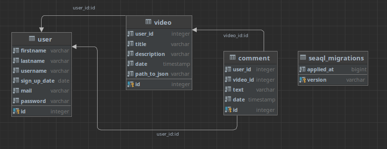
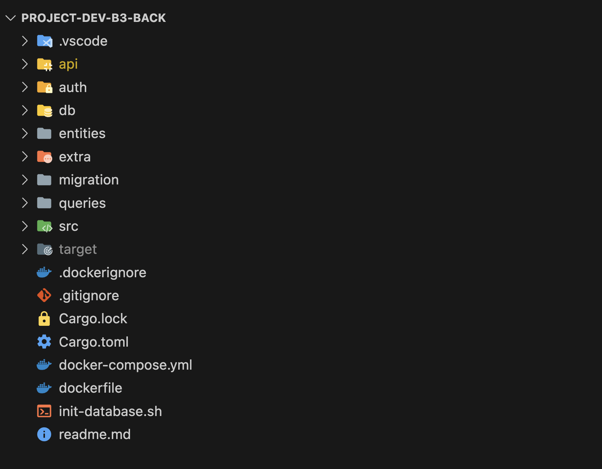

# Backend : Videos to ASCII Art by Codo'Maton



Ce projet est destiné à être utilisé en conjonction avec le projet Dev B3 Front pour fournir une application Web complète.

## Technologies utilisées

<br/>
<div align="center">


</div>
<br/>

---

## Schéma Base de Donnée

<div align="center">

</div>

---

## Installation

Pour installer ce projet, vous devez disposer de Rust et de Cargo installés sur votre système. Ensuite, vous pouvez cloner le dépôt et installer les dépendances en exécutant les commandes suivantes :

```bash
git clone https://gitlab.com/dorianlevee30/project-dev-b3-back.git
cd project-dev-b3-back
docker compose up
cargo build
```

## Utilisation

Une fois que vous avez installé le projet, vous pouvez l'exécuter en utilisant la commande suivante :

```bash
cargo run
```

Cela va démarrer le serveur Web sur le port `7878`. Vous pouvez maintenant accéder à l'API en ouvrant votre navigateur à l'adresse <http://0.0.0.0:7878>.

---

## Architecture

### À Propos de l'architecture du Backend écrit en Rust

Le projet est struturé de manière à être modulable, chacun des dossiers représente une librairie.



- api : Regroupe les handlers ainsi que la table de routage.
- auth : Mise en place de la gestion de connexion utilisateur par le biais du JWT.
- db : Procéssus de connexion à la database.
- entities : Déclaration des Objets "`User`", "`Video`" et "`Comment`".
- extra : Comporte seulement les différentes images pour réaliser le readme.
- migration : Se compose de tous les fichiers de migrations généré par "`SeaORM`".
- queries : Regroupe toutes les requêttes sql utiliser pour les handlers présent dans "`api`".
- src : Base qui regroupe toutes les librairies et qui permet de lancer le projet.
- target : Ce dossier contient les éléments nécesaires au build ainsi que le fichier éxécutable.
- .dockerignore : Permet à docker d'ignorer les fichiers renseigés.
- .gitignore : Permet d'ignorer des fichiers lors de lutilisation de git.
- cargo.lock : Généré automatiquement par le système de construction. Il sert à garantir l'éxactitude des dépendances sont utilisées lors de la construction de l'application ou de la bibliothèque à chaque fois, quel que soit l'environnement de compilation.
- cargo.toml : Fichier de configuration de Rust utilisé par le système de construction Cargo pour définir les métadonnées du package, les dépendances du projet et les options de compilation.
- docker-compose.yml : docker-compose.yml : Fichier de configuration utilisé par Docker Compose pour définir plusieurs conteneurs Docker qui fonctionnent ensemble dans une application.
- dockerfile : Fichier texte qui contient les instructions pour la création d'une image Docker personnalisée.
- init-database.sh : Script d'initialisation de base de données, souvent utilisé pour configurer une base de données dans un conteneur Docker.
- readme.md : Fichier texte contenant les informations sur le projet.

### Gestion des ressources

Afin de rendre le projet moins gourmand en espace, j'ai adapté l'importation des différentes librairies tel que Salvo, Tokio & SeaORM par exemple afin qu'il soit commun à tous les dossiers du projet.

On peut voir dans le fichier cargo.toml :

- Cette implémentation :

```toml
 [workspace]
members = [".", "api", "db", "migration", "queries", "auth"]
```

En définissant le workspace ainsi, il est donc possible de partager les librairies suivantes au sein du projet :

 ```toml
[workspace.dependencies]
tokio = { version = "^1", features = ["macros"] }
futures = "^0.3"
sea-orm = { version = "^0", features = [ "sqlx-postgres", "runtime-tokio-rustls", "with-json", "with-chrono" ] }
sea-orm-migration = "^0"
chrono = "^0.4"
serde = { version = "^1.0", features = ["derive"] }
serde_json = "1.0.93"
bcrypt = "^0.14"
```

- Pour exemple, voici le cargo.toml du dossier entities :

 ```toml
 [dependencies]
tokio = {workspace = true }
futures = {workspace = true }
sea-orm = {workspace = true }
sea-orm-migration = {workspace = true }
chrono = {workspace = true }
serde = {workspace = true }
serde_json = {workspace = true }
bcrypt = {workspace = true }
```

On visualise que les dépendances sont partagées.

---

## API

Listes des routes :

### Utilisateur

- Création d'un compte :

```http
POST : api/signup
```

- Se connecter à partir d'un compte existant :

```http
POST : api/login
```

- Visualiser le compte d'un utilisateur via son id :

 ```http
GET : api/user/<id>
```

### Vidéos

- Lister toutes les vidéos :

 ```http
GET : api/videos
```

- Visualiser une vidéo via son id :

 ```http
GET : api/video/<id>
```

- Supprimer une vidéo via son id :

 ```http
DELETE : api/video/<id>
```

- Poster une vidéo :

 ```http
POST : api/video/upload
```

### Commentaires

- Visualiser le commentaire d'une vidéo à partir de son id :

 ```http
GET : api/comment/<video_id>
```

- Ajouter un commentaire sur une vidéo en utilisant l'id de la vidéo :

 ```http
POST : api/comment/<video_id>
```

- Supprimer le commentaire d'une vidéo à partir de l'id de la vidéo et l'id du commentaire :

 ```http
DELETE : api/comment/<video_id>/<id>
```

---

## Contributeurs

- Levee Dorian : dorianlevee30(at)gmail(dot)com
- Lestage Maxime : maxime.lestage(at)ynov(dot)com
- Rojoa Azad : azad.rojoa(at)ynov(dot)com
- Tarendeau Gaël : gael.tarendeau(at)ynov(dot)com

N'hésitez pas à envoyer un e-mail si vous avez des questions ou des commentaires sur ce projet.
