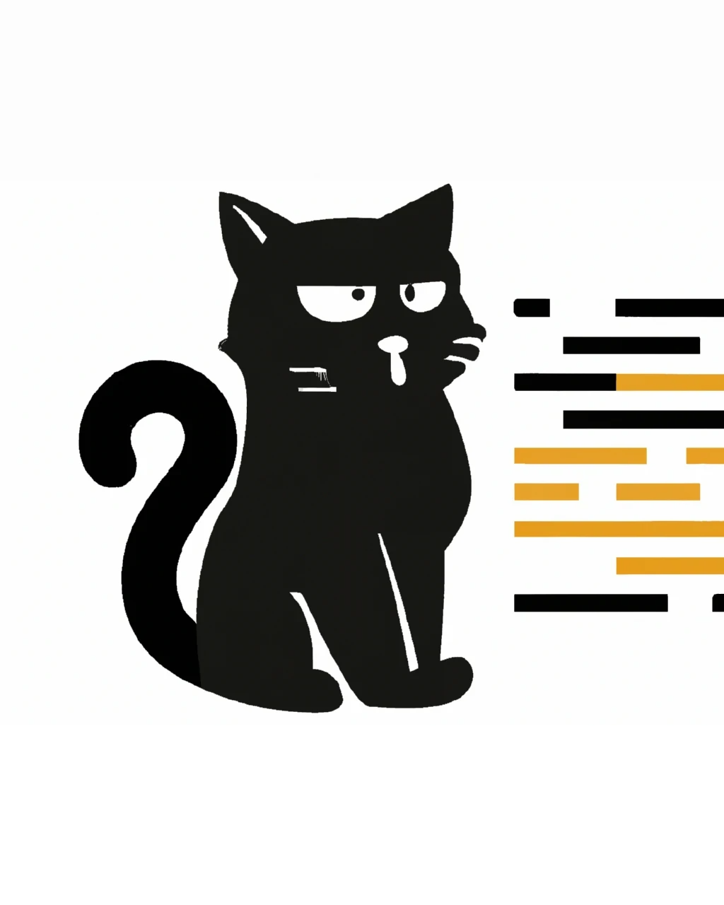

# Projet Dev B3 Back

<div style="text-align:center;">
    
</div>

Ce projet est destiné à être utilisé en conjonction avec le projet Dev B3 Front pour fournir une application Web complète.

## Installation

Pour installer ce projet, vous devez disposer de Rust et de Cargo installés sur votre système. Ensuite, vous pouvez cloner le dépôt et installer les dépendances en exécutant les commandes suivantes :

```bash
git clone https://gitlab.com/dorianlevee30/project-dev-b3-back.git
cd project-dev-b3-back
cargo build
```

## Utilisation

Une fois que vous avez installé le projet, vous pouvez l'exécuter en utilisant la commande suivante :

```bash
cargo run
```

Cela va démarrer le serveur Web sur le port `7878`. Vous pouvez maintenant accéder à l'API en ouvrant votre navigateur à l'adresse <http://0.0.0.0:7878>.

---

## Architecture

### À Propos l'architecture du Backend écrit en Rust

Le projet est struturé de manière à être modulable, chacun des dossiers représente une librairie.

Afin de rendre le projet moins gourmand en espace, j'ai adapté l'importation des différentes librairies tel que Salvo, Tokio & SeaORM par exemple afin qu'il soit commun à tous les dossiers du projet.

On peut voir dans le fichier cargo.toml :

- Cette implémentation :

```toml
 [workspace]
members = [".", "api", "db", "migration", "queries", "auth"]
```

En définissant le workspace aisni, il est donc possible de partager les librairies suivantes au sein du projet :

 ```toml
[workspace.dependencies]
tokio = { version = "^1", features = ["macros"] }
futures = "^0.3"
sea-orm = { version = "^0", features = [ "sqlx-postgres", "runtime-tokio-rustls", "with-json", "with-chrono" ] }
sea-orm-migration = "^0"
chrono = "^0.4"
serde = { version = "^1.0", features = ["derive"] }
serde_json = "1.0.93"
bcrypt = "^0.14"
```

- Pour exemple, voici le cargo.toml du dossier entities :

 ```toml
 [dependencies]
tokio = {workspace = true }
futures = {workspace = true }
sea-orm = {workspace = true }
sea-orm-migration = {workspace = true }
chrono = {workspace = true }
serde = {workspace = true }
serde_json = {workspace = true }
bcrypt = {workspace = true }
```

On visualise que les dépendances sont partagées

---

## API

## Contributeurs

- Dorian Levee <dorianlevee30@gmail.com>

N'hésitez pas à envoyer un e-mail à l'auteur si vous avez des questions ou des commentaires sur ce projet.
